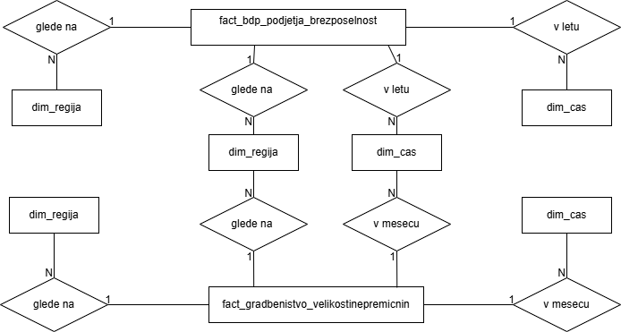

# OPB-skladisce

V najinem projektu bova naredili podatkovno skladišče podatkov. Za fact tabeli bova vzeli tabeli `fact_bdp_podjetja_brezposelnost` in `fact_gradbenistvo_velikostinepremicnin`, ter jim dodali tabele dimenzij. Podatke bova pridobili s spletne strani [SiStat](https://pxweb.stat.si/SiStat/sl). Vse skupaj pa bova nato povezali preko spletnega vmesnika, kjer bova narisali številne diagrame.

*Lara Jeraj in Nina Švigelj*
